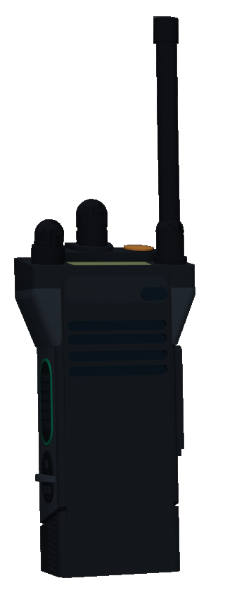

{: style="height:23%;width:23%"} 
# Motorola APX6000
This is a Motorola APX6000 Radio on the first responder P25 system. This radio is used for encrypted communications and is mainly used in Law Enforcement, Medical and Fire. 

##One-Time Payment 
**USD:** $2
or
**ROBUX:** 1000

{: style="height:5%;width:5%"} 